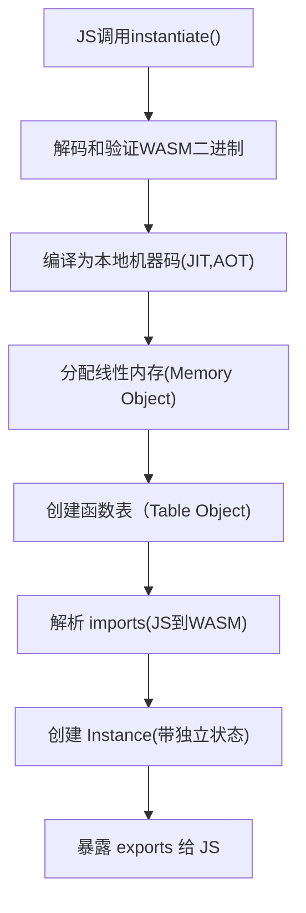

# 本项目探索wasm
wasm是一个值得学习的技术，我相信它一定有深远的发展前景。
wasi开放的标准接口
component-model 

1. wasm是一种低级的二进制指令格式字节码
2. 我们可以使用多种语言实现编写，编译成wasm
3. 使用wasm，或者说运行时, 会执行实例化wasm
4. wasm实例化内部会完成: 编译，链接， 创建运行时实例， 建立JS wasm边界桥接

# JS中wasm实例化流程:

+ JS 和WASM共享同一块内存
+ WASM不能直接访问JS对象
