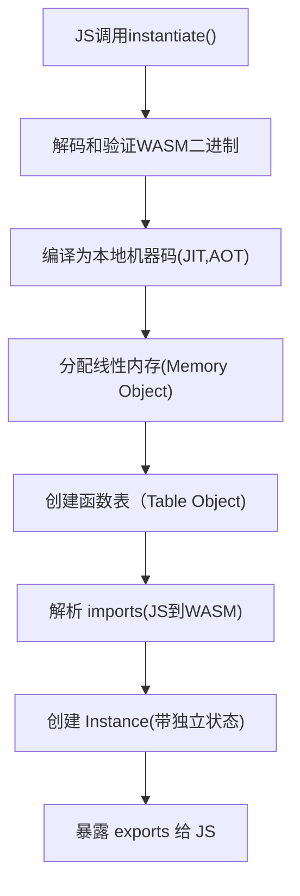

# 本项目探索wasm
wasm是一个值得学习的技术，我相信它一定有深远的发展前景。
wasi开放的标准接口
component-model 

1. wasm是一种低级的二进制指令格式字节码
2. 我们可以使用多种语言实现编写，编译成wasm
3. 使用wasm，或者说运行时, 会执行实例化wasm
4. wasm实例化内部会完成: 编译，链接， 创建运行时实例， 建立JS wasm边界桥接

# JS中wasm实例化流程:

+ JS 和WASM共享同一块内存
+ WASM不能直接访问JS对象

# jswasm项目 探索JS和wasm交互,nginx部署后


# wasmc项目实现了wit 到wasm的编译过程，wit中只有export
wit中 interface 对应  Rust  Guest  trait
核心代码:
```
wit_bindgen::generate!({
    world: "calculator",
    path: "./wit",
});
```
生成代码: (cargo expand)
```
#[allow(dead_code)]
pub mod exports {
    #[allow(dead_code)]
    pub mod docs {
        #[allow(dead_code)]
        pub mod calculator {
            #[allow(dead_code, clippy::all)]
            pub mod calculate {
                #[used]
                #[doc(hidden)]
                static __FORCE_SECTION_REF: fn() = super::super::super::super::__link_custom_section_describing_imports;
                use super::super::super::super::_rt;
                #[repr(u8)]
                pub enum Op {
                    Add,
                    Subtract,
                }
                #[automatically_derived]
                #[doc(hidden)]
                unsafe impl ::core::clone::TrivialClone for Op {}
                #[automatically_derived]
                impl ::core::clone::Clone for Op {
                    #[inline]
                    fn clone(&self) -> Op {
                        *self
                    }
                }
                #[automatically_derived]
                impl ::core::marker::Copy for Op {}
                #[automatically_derived]
                impl ::core::cmp::Eq for Op {
                    #[inline]
                    #[doc(hidden)]
                    #[coverage(off)]
                    fn assert_receiver_is_total_eq(&self) -> () {}
                }
                #[automatically_derived]
                impl ::core::marker::StructuralPartialEq for Op {}
                #[automatically_derived]
                impl ::core::cmp::PartialEq for Op {
                    #[inline]
                    fn eq(&self, other: &Op) -> bool {
                        let __self_discr = ::core::intrinsics::discriminant_value(self);
                        let __arg1_discr = ::core::intrinsics::discriminant_value(other);
                        __self_discr == __arg1_discr
                    }
                }
                impl ::core::fmt::Debug for Op {
                    fn fmt(
                        &self,
                        f: &mut ::core::fmt::Formatter<'_>,
                    ) -> ::core::fmt::Result {
                        match self {
                            Op::Add => f.debug_tuple("Op::Add").finish(),
                            Op::Subtract => f.debug_tuple("Op::Subtract").finish(),
                        }
                    }
                }
                impl Op {
                    #[doc(hidden)]
                    pub unsafe fn _lift(val: u8) -> Op {
                        if !true {
                            return ::core::mem::transmute(val);
                        }
                        match val {
                            0 => Op::Add,
                            1 => Op::Subtract,
                            _ => {
                                ::core::panicking::panic_fmt(
                                    format_args!("invalid enum discriminant"),
                                );
                            }
                        }
                    }
                }
                #[doc(hidden)]
                #[allow(non_snake_case)]
                pub unsafe fn _export_eval_expression_cabi<T: Guest>(
                    arg0: i32,
                    arg1: i32,
                    arg2: i32,
                ) -> i32 {
                    let result0 = T::eval_expression(
                        Op::_lift(arg0 as u8),
                        arg1 as u32,
                        arg2 as u32,
                    );
                    _rt::as_i32(result0)
                }
                pub trait Guest {
                    fn eval_expression(op: Op, x: u32, y: u32) -> u32;
                }
                #[doc(hidden)]
                pub(crate) use __export_docs_calculator_calculate_0_1_0_cabi;
            }
        }
    }
}
mod _rt {
    pub fn as_i32<T: AsI32>(t: T) -> i32 {
        t.as_i32()
    }
    pub trait AsI32 {
        fn as_i32(self) -> i32;
    }
    impl<'a, T: Copy + AsI32> AsI32 for &'a T {
        fn as_i32(self) -> i32 {
            (*self).as_i32()
        }
    }
    impl AsI32 for i32 {
        #[inline]
        fn as_i32(self) -> i32 {
            self as i32
        }
    }
    impl AsI32 for u32 {
        #[inline]
        fn as_i32(self) -> i32 {
            self as i32
        }
    }
    impl AsI32 for i16 {
        #[inline]
        fn as_i32(self) -> i32 {
            self as i32
        }
    }
    impl AsI32 for u16 {
        #[inline]
        fn as_i32(self) -> i32 {
            self as i32
        }
    }
    impl AsI32 for i8 {
        #[inline]
        fn as_i32(self) -> i32 {
            self as i32
        }
    }
    impl AsI32 for u8 {
        #[inline]
        fn as_i32(self) -> i32 {
            self as i32
        }
    }
    impl AsI32 for char {
        #[inline]
        fn as_i32(self) -> i32 {
            self as i32
        }
    }
    impl AsI32 for usize {
        #[inline]
        fn as_i32(self) -> i32 {
            self as i32
        }
    }
}
#[doc(inline)]
pub(crate) use __export_calculator_impl as export;
#[inline(never)]
#[doc(hidden)]
pub fn __link_custom_section_describing_imports() {
    wit_bindgen::rt::maybe_link_cabi_realloc();
}
const _: &[u8] = b"package docs:calculator@0.1.0;\n\ninterface calculate {\n    enum op {\n        add,\n        subtract,\n    }\n\n    eval-expression: func(\n        op: op,\n        x: u32,\n        y: u32\n    ) -> u32;\n}\n\nworld calculator {\n    export calculate;\n}\n";
use crate::exports::docs::calculator::calculate::{Guest, Op};
struct Calculator;
impl Guest for Calculator {
    fn eval_expression(op: Op, x: u32, y: u32) -> u32 {
        match op {
            Op::Add => x + y,
            Op::Subtract => x.saturating_sub(y),
        }
    }
}
const _: () = {
    #[export_name = "docs:calculator/calculate@0.1.0#eval-expression"]
    unsafe extern "C" fn export_eval_expression(arg0: i32, arg1: i32, arg2: i32) -> i32 {
        self::exports::docs::calculator::calculate::_export_eval_expression_cabi::<
            Calculator,
        >(arg0, arg1, arg2)
    }
};
```
也可以直接生成
```
wit-bindgen rust adder.wit
```
1. build
  ```
    # rustup target add wasm32-wasip2
    cargo build --target=wasm32-wasip2 --release
  ```
2. 查看
  ```
    root@wujq:~/wasm1/wasmc# du -hs  target/wasm32-wasip2/release/wasmc.wasm
    16K	   target/wasm32-wasip2/release/wasmc.wasm
  ```
3. 查看你wasm的wit信息
  ```
    wasm-tools component wit target/wasm32-wasip2/release/wasmc.wasm
  ```
# wasmc.wasm怎么跑起来?
## wasi preview2
被称为WASI 0.2是WASM系统接口WASI规范,它通过引入组件模型(Component Model),让Wasm真正具备跨语言，高安全，模块化的能力。
WASI 的目标是让同一份 .wasm二进制文件能够在任何地方（从微型 IoT 设备到庞大的云服务集群，甚至不同的操作系统）不加修改地运行。它屏蔽了底层操作系统的差异，提供了一套虚拟化的抽象接口。
WASI 的出现，本质上是在解决一个核心矛盾：如何让不受信任的代码在安全隔离的前提下，又能够高效地与系统进行交互。

1. WASI 0.2.0包含API

| Proposal          | Version |
|-------------------|---------|
| [wasi-io]         | 0.2.8   |
| [wasi-clocks]     | 0.2.8   |
| [wasi-random]     | 0.2.8   |
| [wasi-filesystem] | 0.2.8   |
| [wasi-sockets]    | 0.2.8   |
| [wasi-cli]        | 0.2.8   |
| [wasi-http]       | 0.2.8   |

[wasi-io]: https://github.com/WebAssembly/wasi-io
[wasi-clocks]: https://github.com/WebAssembly/wasi-clocks
[wasi-random]: https://github.com/WebAssembly/wasi-random
[wasi-filesystem]: https://github.com/WebAssembly/wasi-filesystem
[wasi-sockets]: https://github.com/WebAssembly/wasi-sockets
[wasi-cli]: https://github.com/WebAssembly/wasi-cli
[wasi-http]: https://github.com/WebAssembly/wasi-http

2. 主流的运行时 wasmtime,spin,WasmEdge都已经将WASI 0.2 作为默认标准。
## 使用wasmtime跑wasm
1. 直接运行会报错，因为这是个组件模型，没有主函数。
```
wasmtime run  target/wasm32-wasip2/release/wasmc.wasm
Error: failed to run main module `target/wasm32-wasip2/release/wasmc.wasm`

Caused by:
    no exported instance named `wasi:cli/run@0.2.6`
```
2. 需要调用组件中的函数
```
wasmtime run --invoke 'eval-expression(add,3,4)'  target/wasm32-wasip2/release/wasmc.wasm
7
```

## Wasmtime 是怎么实现 WASI 的
用 Rust 写一系列“宿主函数”（Host Functions），将这些函数注册到 Wasmtime 的 Linker 中，当 WebAssembly 代码调用 WASI 接口时，就会跳转到这些 Rust 函数里执行，最终由 Rust 代为发起操作系统的真实系统调用。

请看runwasm项目

# 接下来介绍[spin项目](https://github.com/spinframework/spin),
它是在wasmtime基础上做的，wasmtime相对于它的发动机，spin相当于整个车子.

[k8s 运行spin,参考spinkube](https://www.spinkube.dev/docs/overview/)
